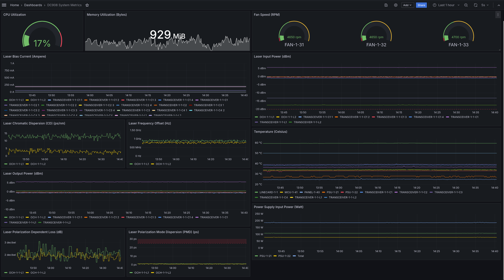

# dc908\_exporter

[](https://goreportcard.com/report/github.com/sonix-network/dc908_exporter)

Simple collector designed to take the gNMI dialout stream from one or more
[Huawei OptiXtrans DC908](https://e.huawei.com/en/products/optical-transmission/dc908)
and export the real-time updates as native Prometheus metrics.

The Huawei OptiXtrans DC908 is a optical-electrical Wavelength Division Multiplexing (WDM) transmission device designed for Data Center Interconnect (DCI).

The exporter operates two ports by default, both can be changed via command line flags:

 - `8888` - used to receive gNMI telemetry dialout connections.
 - `9908` - used to present metric data to a Prometheus or OpenMetrics compatible scraper.



## DC908 configuration

It is important to enable the statistics task for at least `15m` or the DC908
will not report any metrics except for RMON data.

Here is an example configuration on the DC908:

```
# Enable metrics collection
system-view
grpc
protocol no-tls
pm
start statistics-task sdh_15minute_default now
stop statistics-task sdh_15minute_default at 2087-12-31 00:00:00
return

# Define what to send and to where
system-view
telemetry
sensor-group my-sensors
sensor-path /openconfig-platform:components/component/cpu/openconfig-platform-cpu:utilization
sensor-path /openconfig-platform:components/component/openconfig-platform-transceiver:transceiver/physical-channels/channel/state
sensor-path /openconfig-platform:components/component/openconfig-terminal-device:optical-channel/state
sensor-path /openconfig-platform:components/component/openconfig-platform-transceiver:transceiver/state
sensor-path /openconfig-platform:components/component/power-supply/state
sensor-path /openconfig-interfaces:interfaces/interface/state/counters
sensor-path /openconfig-platform:components/component/fan/state
sensor-path /openconfig-platform:components/component/state
destination-group exporter
destination ipv4-address 1.2.3.4 port 8888
subscription my-subscription
add sensor-group my-sensors sample-interval 5000 suppress-redundant false heartbeat-interval 10
add destination-group exporter
protocol grpc encoding json_ietf
return
```

Replace the `1.2.3.4` with the IPv4 of the instance of `dc908_exporter`. Leave
port `8888` unless you changed it in the exporter.

## Prometheus configuration

The DC908 is a "blackbox"-style exporter where it allows multiple incoming gNMI
streams to be handled by a single exporter. Thus, there is some special needs
in the Prometheus configuration in order to be able to separate the gNMI streams
into specific transponder instances.

Example configuration assuming you have two DC908 transponders at `10.1.1.1` and
`10.2.2.2` called `my-xpd-1` and `my-xpd-2` respectively.

**NOTE:** If you run the exporter on a machine other than the Prometheus server,
change the `127.0.0.1:9908` accordingly.

```yaml
scrape_configs:
  - job_name: "dc908"
    metrics_path: '/probe'

    static_configs:
    - targets:
      - 10.1.1.1
      labels:
        exporter: 127.0.0.1:9908
        __name: my-xpd-1
    - targets:
      - 10.2.2.2
      labels:
        exporter: 127.0.0.1:9908
        __name: my-xpd-2

    relabel_configs:
    - source_labels: [__address__]
      target_label: __param_target
    - source_labels: [exporter]
      target_label: __address__
    - source_labels: [__name]
      target_label: instance
    - action: labeldrop
      regex: __name
```

## Example metrics

```
# HELP dc908_cpu_utilization_ratio Ratio (0.0 - 1.0) of CPU utilization.
# TYPE dc908_cpu_utilization_ratio gauge
dc908_cpu_utilization_ratio{device="MCU-1-41"} 0.17
# HELP dc908_fan_rpm Current fan speed in RPM.
# TYPE dc908_fan_rpm gauge
dc908_fan_rpm{device="FAN-1-31"} 4300
dc908_fan_rpm{device="FAN-1-32"} 4300
dc908_fan_rpm{device="FAN-1-33"} 4350
# HELP dc908_laser_bias_current_amepere The current applied by the system to the transmit laser to achieve the output power.
# TYPE dc908_laser_bias_current_amepere gauge
dc908_laser_bias_current_amepere{device="OCH-1-1-L1",index=""} 181.4
dc908_laser_bias_current_amepere{device="OCH-1-1-L2",index=""} 201.9
dc908_laser_bias_current_amepere{device="TRANSCEIVER-1-1-C1",index=""} 0
dc908_laser_bias_current_amepere{device="TRANSCEIVER-1-1-C1",index="1"} 55
dc908_laser_bias_current_amepere{device="TRANSCEIVER-1-1-C1",index="2"} 55.5
dc908_laser_bias_current_amepere{device="TRANSCEIVER-1-1-C1",index="3"} 55
dc908_laser_bias_current_amepere{device="TRANSCEIVER-1-1-C1",index="4"} 55
dc908_laser_bias_current_amepere{device="TRANSCEIVER-1-1-C2",index=""} 0
dc908_laser_bias_current_amepere{device="TRANSCEIVER-1-1-C2",index="1"} 0
dc908_laser_bias_current_amepere{device="TRANSCEIVER-1-1-C2",index="2"} 0
dc908_laser_bias_current_amepere{device="TRANSCEIVER-1-1-C2",index="3"} 0
dc908_laser_bias_current_amepere{device="TRANSCEIVER-1-1-C2",index="4"} 0
dc908_laser_bias_current_amepere{device="TRANSCEIVER-1-1-C3",index=""} 0
dc908_laser_bias_current_amepere{device="TRANSCEIVER-1-1-C3",index="1"} 0
dc908_laser_bias_current_amepere{device="TRANSCEIVER-1-1-C3",index="2"} 0
dc908_laser_bias_current_amepere{device="TRANSCEIVER-1-1-C3",index="3"} 0
dc908_laser_bias_current_amepere{device="TRANSCEIVER-1-1-C3",index="4"} 0
dc908_laser_bias_current_amepere{device="TRANSCEIVER-1-1-C4",index=""} 0
dc908_laser_bias_current_amepere{device="TRANSCEIVER-1-1-C4",index="1"} 0
dc908_laser_bias_current_amepere{device="TRANSCEIVER-1-1-C4",index="2"} 0
dc908_laser_bias_current_amepere{device="TRANSCEIVER-1-1-C4",index="3"} 0
dc908_laser_bias_current_amepere{device="TRANSCEIVER-1-1-C4",index="4"} 0
dc908_laser_bias_current_amepere{device="TRANSCEIVER-1-1-L1",index=""} 181.4
dc908_laser_bias_current_amepere{device="TRANSCEIVER-1-1-L2",index=""} 201.9
# HELP dc908_laser_chromatic_dispersion_ps_nm Chromatic Dispersion of an optical channel in picoseconds / nanometer (ps/nm).
# TYPE dc908_laser_chromatic_dispersion_ps_nm gauge
dc908_laser_chromatic_dispersion_ps_nm{device="OCH-1-1-L1"} 12
dc908_laser_chromatic_dispersion_ps_nm{device="OCH-1-1-L2"} 1
# HELP dc908_laser_frequency_offset_hertz Frequency offset from reference frequency.
# TYPE dc908_laser_frequency_offset_hertz gauge
dc908_laser_frequency_offset_hertz{device="OCH-1-1-L1"} 933
dc908_laser_frequency_offset_hertz{device="OCH-1-1-L2"} 840
# HELP dc908_laser_input_power_dbm The input optical power of a physical channel in dBm.
# TYPE dc908_laser_input_power_dbm gauge
dc908_laser_input_power_dbm{device="OCH-1-1-L1",index=""} -13.2
dc908_laser_input_power_dbm{device="OCH-1-1-L2",index=""} -17.4
dc908_laser_input_power_dbm{device="TRANSCEIVER-1-1-C1",index=""} 5.6
dc908_laser_input_power_dbm{device="TRANSCEIVER-1-1-C1",index="1"} -0.2
dc908_laser_input_power_dbm{device="TRANSCEIVER-1-1-C1",index="2"} -0.1
dc908_laser_input_power_dbm{device="TRANSCEIVER-1-1-C1",index="3"} -0.6
dc908_laser_input_power_dbm{device="TRANSCEIVER-1-1-C1",index="4"} -1
dc908_laser_input_power_dbm{device="TRANSCEIVER-1-1-C2",index=""} -60
dc908_laser_input_power_dbm{device="TRANSCEIVER-1-1-C2",index="1"} -60
dc908_laser_input_power_dbm{device="TRANSCEIVER-1-1-C2",index="2"} -60
dc908_laser_input_power_dbm{device="TRANSCEIVER-1-1-C2",index="3"} -60
dc908_laser_input_power_dbm{device="TRANSCEIVER-1-1-C2",index="4"} -60
dc908_laser_input_power_dbm{device="TRANSCEIVER-1-1-C3",index=""} -60
dc908_laser_input_power_dbm{device="TRANSCEIVER-1-1-C3",index="1"} -60
dc908_laser_input_power_dbm{device="TRANSCEIVER-1-1-C3",index="2"} -60
dc908_laser_input_power_dbm{device="TRANSCEIVER-1-1-C3",index="3"} -60
dc908_laser_input_power_dbm{device="TRANSCEIVER-1-1-C3",index="4"} -60
dc908_laser_input_power_dbm{device="TRANSCEIVER-1-1-C4",index=""} -60
dc908_laser_input_power_dbm{device="TRANSCEIVER-1-1-C4",index="1"} -60
dc908_laser_input_power_dbm{device="TRANSCEIVER-1-1-C4",index="2"} -60
dc908_laser_input_power_dbm{device="TRANSCEIVER-1-1-C4",index="3"} -60
dc908_laser_input_power_dbm{device="TRANSCEIVER-1-1-C4",index="4"} -60
dc908_laser_input_power_dbm{device="TRANSCEIVER-1-1-L1",index=""} -13.2
dc908_laser_input_power_dbm{device="TRANSCEIVER-1-1-L2",index=""} -17.4
# HELP dc908_laser_output_power_dbm The output optical power of a physical channel in dBm.
# TYPE dc908_laser_output_power_dbm gauge
dc908_laser_output_power_dbm{device="OCH-1-1-L1",index=""} 0.5
dc908_laser_output_power_dbm{device="OCH-1-1-L2",index=""} 0.5
dc908_laser_output_power_dbm{device="TRANSCEIVER-1-1-C1",index=""} 5.3
dc908_laser_output_power_dbm{device="TRANSCEIVER-1-1-C1",index="1"} -1
dc908_laser_output_power_dbm{device="TRANSCEIVER-1-1-C1",index="2"} -0.4
dc908_laser_output_power_dbm{device="TRANSCEIVER-1-1-C1",index="3"} -0.8
dc908_laser_output_power_dbm{device="TRANSCEIVER-1-1-C1",index="4"} -0.7
dc908_laser_output_power_dbm{device="TRANSCEIVER-1-1-C2",index=""} -60
dc908_laser_output_power_dbm{device="TRANSCEIVER-1-1-C2",index="1"} -60
dc908_laser_output_power_dbm{device="TRANSCEIVER-1-1-C2",index="2"} -60
dc908_laser_output_power_dbm{device="TRANSCEIVER-1-1-C2",index="3"} -60
dc908_laser_output_power_dbm{device="TRANSCEIVER-1-1-C2",index="4"} -60
dc908_laser_output_power_dbm{device="TRANSCEIVER-1-1-C3",index=""} -60
dc908_laser_output_power_dbm{device="TRANSCEIVER-1-1-C3",index="1"} -60
dc908_laser_output_power_dbm{device="TRANSCEIVER-1-1-C3",index="2"} -60
dc908_laser_output_power_dbm{device="TRANSCEIVER-1-1-C3",index="3"} -60
dc908_laser_output_power_dbm{device="TRANSCEIVER-1-1-C3",index="4"} -60
dc908_laser_output_power_dbm{device="TRANSCEIVER-1-1-C4",index=""} -60
dc908_laser_output_power_dbm{device="TRANSCEIVER-1-1-C4",index="1"} -60
dc908_laser_output_power_dbm{device="TRANSCEIVER-1-1-C4",index="2"} -60
dc908_laser_output_power_dbm{device="TRANSCEIVER-1-1-C4",index="3"} -60
dc908_laser_output_power_dbm{device="TRANSCEIVER-1-1-C4",index="4"} -60
dc908_laser_output_power_dbm{device="TRANSCEIVER-1-1-L1",index=""} 0.5
dc908_laser_output_power_dbm{device="TRANSCEIVER-1-1-L2",index=""} 0.5
# HELP dc908_laser_polarization_dependent_loss_db Polarization Dependent Loss of an optical channel in dB.
# TYPE dc908_laser_polarization_dependent_loss_db gauge
dc908_laser_polarization_dependent_loss_db{device="OCH-1-1-L1"} 2.2
dc908_laser_polarization_dependent_loss_db{device="OCH-1-1-L2"} 2
# HELP dc908_laser_polarization_mode_dispersion_ps Polarization Mode Dispersion of an optical channel in picoseconds (ps).
# TYPE dc908_laser_polarization_mode_dispersion_ps gauge
dc908_laser_polarization_mode_dispersion_ps{device="OCH-1-1-L1"} 1
dc908_laser_polarization_mode_dispersion_ps{device="OCH-1-1-L2"} 1
# HELP dc908_memory_utilized_bytes The number of bytes of memory currently in use by processes running on the component, not considering reserved memory that is not available for use.
# TYPE dc908_memory_utilized_bytes gauge
dc908_memory_utilized_bytes{device="MCU-1-41"} 9.85468928e+08
# HELP dc908_power_supply_input_current_ampere Current input current on a power supply.
# TYPE dc908_power_supply_input_current_ampere gauge
dc908_power_supply_input_current_ampere{device="PSU-1-21"} 0.46700000762939453
dc908_power_supply_input_current_ampere{device="PSU-1-22"} 0.335999995470047
# HELP dc908_power_supply_input_voltage Current input current on a power supply.
# TYPE dc908_power_supply_input_voltage gauge
dc908_power_supply_input_voltage{device="PSU-1-21"} 229
dc908_power_supply_input_voltage{device="PSU-1-22"} 229
# HELP dc908_power_supply_output_current_ampere Current output current on a power supply.
# TYPE dc908_power_supply_output_current_ampere gauge
dc908_power_supply_output_current_ampere{device="PSU-1-21"} 1.5299999713897705
dc908_power_supply_output_current_ampere{device="PSU-1-22"} 1
# HELP dc908_power_supply_output_voltage Current output voltage on a power supply.
# TYPE dc908_power_supply_output_voltage gauge
dc908_power_supply_output_voltage{device="PSU-1-21"} 53
dc908_power_supply_output_voltage{device="PSU-1-22"} 53
# HELP dc908_temperature_celsius Current temperature of components.
# TYPE dc908_temperature_celsius gauge
dc908_temperature_celsius{device="LINECARD-1-1"} 61.8
dc908_temperature_celsius{device="MCU-1-41"} 35.2
dc908_temperature_celsius{device="PANEL-1-40"} 25.3
dc908_temperature_celsius{device="PSU-1-21"} 28
dc908_temperature_celsius{device="PSU-1-22"} 32
dc908_temperature_celsius{device="TRANSCEIVER-1-1-C1"} 40.1
dc908_temperature_celsius{device="TRANSCEIVER-1-1-C2"} 38.2
dc908_temperature_celsius{device="TRANSCEIVER-1-1-C3"} 40.7
dc908_temperature_celsius{device="TRANSCEIVER-1-1-C4"} 35.7
dc908_temperature_celsius{device="TRANSCEIVER-1-1-L1"} 50
dc908_temperature_celsius{device="TRANSCEIVER-1-1-L2"} 50
```
